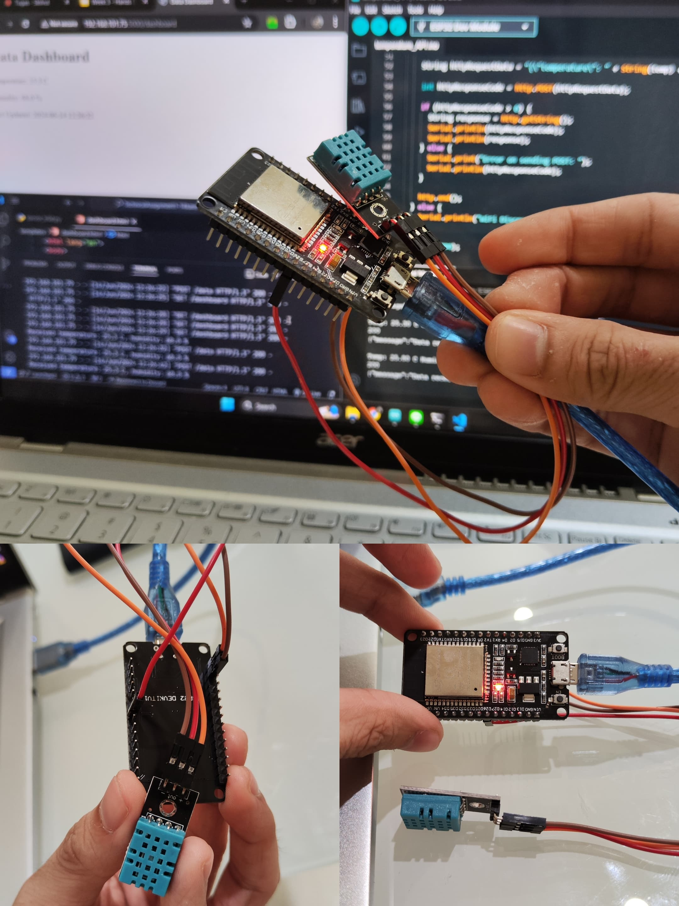
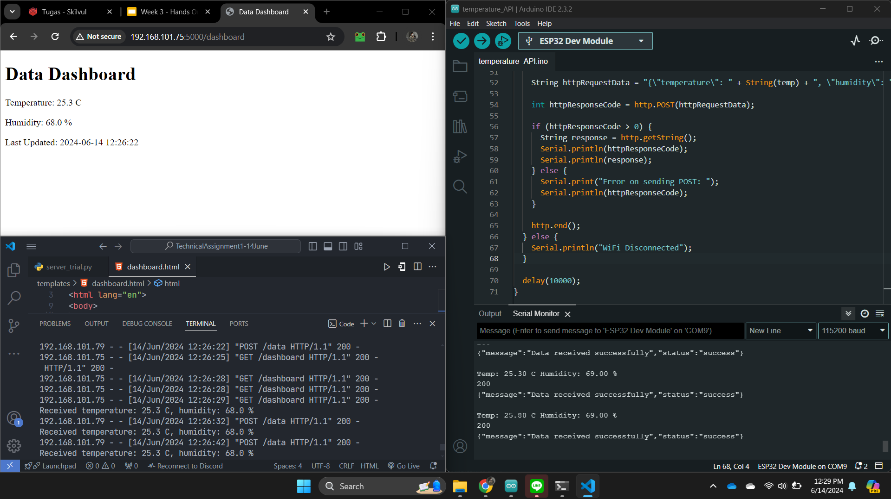

# AIOT Project: ESP32 Temperature Sensor Assignment

This project is part of an AIOT assignment involving an ESP32 microcontroller connected to a temperature sensor. The assignment requires the setup of an ESP32 to collect temperature data and send it to a local server via HTTP REST API. Additionally, a Python server is set up to receive the data and display it on a dashboard.

## Setup Instructions

1. **Hardware Setup**: Connect the temperature sensor to the ESP32 microcontroller. Refer to the image below for the physical setup.

    

2. **Arduino Setup**: Upload the provided Arduino sketch to the ESP32 using the Arduino IDE. This sketch reads temperature data from the sensor and sends it to the local server via HTTP POST requests.

3. **Python Server Setup**: Run the provided Python server script (`server_trial.py`) on your local machine. This server receives the temperature data from the ESP32 and displays it on a dashboard.

4. **Accessing the Dashboard**: Once the server is running, open a web browser and navigate to `http://localhost:5000/dashboard` to view the dashboard. The dashboard will display the latest temperature and humidity readings.

## Dashboard View

Below is a screenshot of the dashboard displaying the temperature and humidity readings:

